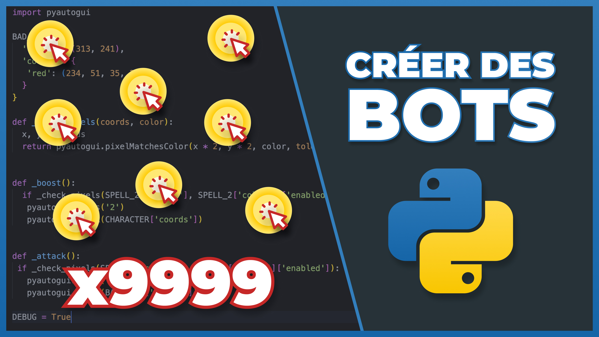

Lien vers la vidéo : 
- [Comment faire un bot Python avec PyAutoGUI ? + Pillow, OpenCV et PyTesseract](https://www.youtube.com/watch?v=yEYN4P0lRzY&list=PLeXyx0kOyiXtq9L7Bgix4Gqp_WXZoSy8z&index=56&pp=gAQBiAQB)

Lien vers le code du sites avec les différentes pages :
- Lien vers [le code du site vu dans cette vidéo](https://github.com/commentcoder/bot-playgrounds)
- Lien vers [le site avec la grille à parcourir avec le curseur et les trois jeux](https://commentcoder.github.io/bot-playgrounds/)
